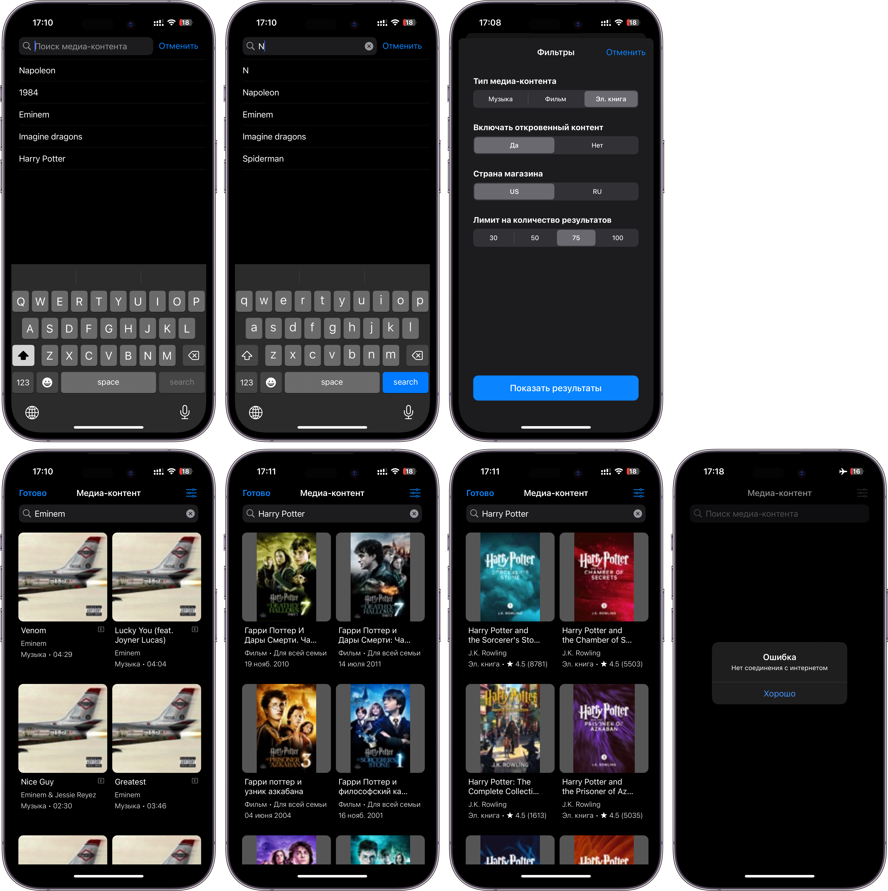
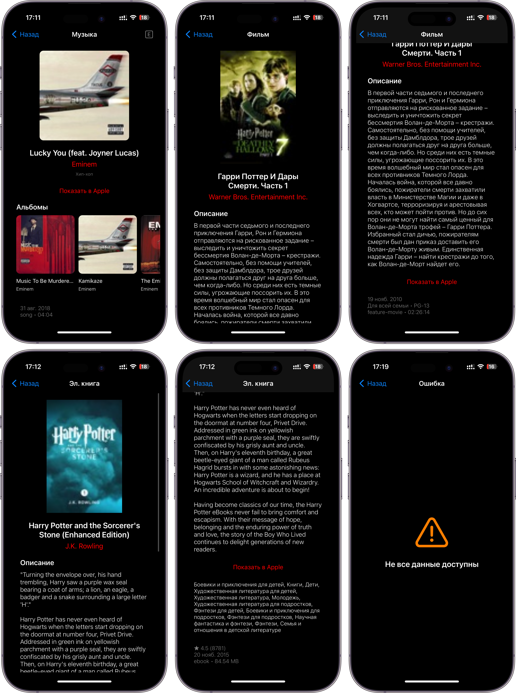
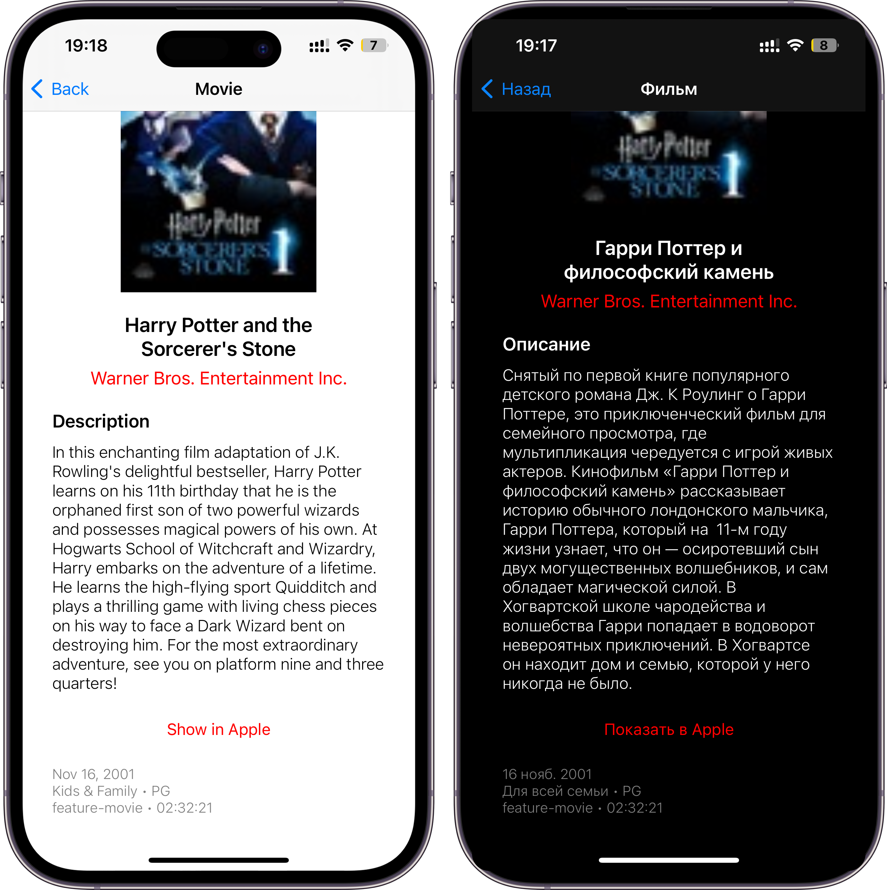

# iTunes приложение

## Оглавление
<ol>
<li><a href="#about-the-project">О проекте</a>
  <ul>
    <li><a href="#technologies-used">Использованные технологии</a></li>
  </ul>
</li>
<li><a href="#getting-started">Инструкция по запуску</a>
  <ul>
    <li><a href="#requirements">Требования</a></li>
  </ul>
</li>
<li><a href="#description-and-demo-screens">Описание и Демо-скрины</a>
  <ul>
    <li><a href="#search-media-content-screen">Экран поиска медиа-контента</a></li>
    <li><a href="#media-content-detail-screen">Экран с детальной информацией о контенте</a></li>
    <li><a href="#additional-functionality">Дополнительно</a></li>
    <li><a href="#demo-video">Демо-видео</a></li>
  </ul>
</li>
<li><a href="#contacts">Контакты</a></li>
</ol>


<a id="about-the-project"></a>
## О проекте

iOS приложение для поиска медиа-контента и просмотра детальной информации с использованием [iTunes Search API](https://developer.apple.com/library/archive/documentation/AudioVideo/Conceptual/iTuneSearchAPI/index.html#//apple_ref/doc/uid/TP40017632-CH3-SW1). 


<a id="technologies-used"></a>
### Использованные технологии

* [iTunes Search API](https://developer.apple.com/library/archive/documentation/AudioVideo/Conceptual/iTuneSearchAPI/index.html#//apple_ref/doc/uid/TP40017632-CH3-SW1)
* Swift + UIKit
* URLSession для networking
* UserDefaults для хранения
* GCD для многопоточности
* MVP архитектура с Coordinator

<a id="getting-started"></a>
## Инструкция по запуску

1) Склонируйте репозиторий
    ```
    git clone https://github.com/shabalin13/iTunes.git
    ```
2) Откройте и запустите проект на симуляторе или физическом iPhone
3) Наслаждайтесь приложением

<a id="requirements"></a>
### Требования
* iOS 13.0 или выше

<a id="description-and-demo-screens"></a>
## Описание и Демо-скрины

<a id="search-media-content-screen"></a>
### Экран поиска медиа-контента
Экран, на котором у пользователя есть возможность выполнить поиск медиа-контента по строковому запросу. При вводе строкового запроса в поле поиска изначально отображаются последние 5 запросов. По мере ввода отображаются подсказки на основе введенного значения (подсказки берутся из истории запросов). 

Также есть экран с фильтрами для запросов. Можно выбрать:
1) Тип медиа-контента (music - default, movie, ebook)
2) Показывать ли откровенный контент (Yes - default)
3) Страна магазина, в котором производить поиск (US - default или RU)
4) Максимальное количество выдаваемых результатов (30 - default)

P.S. Внутри приложения также к запросу добавляются entity к music - song, к movie - movie, к ebook - ebook.

Сделать запрос можно, нажав кнопку Search на клавиатуре или выбрав нужный элемент из подсказок. Результаты отображаются на экране в виде 2 столбцов с краткой информацией о каждом медиа-контенте. Информация различается в зависимости от типа контента.

1) С типом Music отображаются:
* Обложка песни
* Название песни
* Explicit ли контент
* Имя автора
* Тип
* Продолжительность песни

2) С типом Movie отображаются:
* Обложка фильма
* Название фильма
* Тип
* Жанр
* Дата выхода

3) С типом Ebook отображаются:
* Обложка книги
* Название книги
* Имя автора
* Тип
* Средний рейтинг книги (с количеством отзывов)

Во время загрузки из интернета на экране отображается Индикатор Активности.
Если какое-то поле не пришло в ответе, то либо оно не отображается, либо используется дефолтное значение.
Если произошла какая-то ошибка во время запроса, то на экране выводится соответствующая ошибка.

#### Техническая информация: 

Во время ввода запроса в поисковую строку, значения для подсказок и истории достаются из `UserDefaults`, фильтруются и отображаются на экране. Во время запроса сохраняется текущий запрос в историю (`UserDefaults`), собираются все выбранные параметры (фильтры) и делается запрос с помощью `URLSession`. Если все прошло успешно, информация отображается на экране, если нет, то - ошибка. Картинки загружаются из интернета по мере прокрутки контента.




<a id="media-content-detail-screen"></a>
### Экран с детальной информацией о контенте
Выбрав нужный контент, пользователь попадает на экран с расширенной информацией о выбранном медиа-контенте. Отображаемая информация различается в зависимости от типа контента. 

1) С типом Music отображаются:
* Обложка песни
* Название песни
* Explicit ли контент
* Имя автора, нажав на которое можно перейти на страницу автора в Apple
* Жанр
* Гиперссылка на страницу выбранного медиа-контента в Apple
* Другие 5 альбомов автора
* Дата выпуска
* Тип и продолжительность песни

2) С типом Movie отображаются:
* Обложка фильма
* Название фильма
* Название кинокомпании, нажав на которое можно перейти на страницу в Apple
* Описание фильма
* Гиперссылка на страницу выбранного медиа-контента в Apple
* Дата выпуска
* Жанр и возрастное ограничение
* Тип и продолжительность фильма

3) С типом Ebook отображаются:
* Обложка книги
* Название книги
* Имя автора, нажав на которое можно перейти на страницу автора в Apple
* Описание книги
* Гиперссылка на страницу выбранного медиа-контента в Apple
* Жанры
* Средний рейтинг книги (с количеством отзывов)
* Дата выпуска
* Тип и размер книги

Во время загрузки из интернета на экране отображается Индикатор Активности.
Если какое-то поле не пришло в ответе, то либо оно не отображается, либо используется дефолтное значение.
Если произошла какая-то ошибка во время запроса или отсутствует важная информация, то на экране выводится ошибка.

#### Техническая информация:

После перехода на экран детальной информации делается запрос на получение изображения контента, [Lookup](https://developer.apple.com/library/archive/documentation/AudioVideo/Conceptual/iTuneSearchAPI/LookupExamples.html#//apple_ref/doc/uid/TP40017632-CH7-SW1) запрос для получения дополнительной информации и ссылки на страницу в Apple. Также, если это запрос для music типа, то выполняется [Lookup](https://developer.apple.com/library/archive/documentation/AudioVideo/Conceptual/iTuneSearchAPI/LookupExamples.html#//apple_ref/doc/uid/TP40017632-CH7-SW1) запрос для получения других альбомов автора. Для синхронизации получения данных используется `DispatchGroup`. Если все прошло успешно, информация отображается на экране. Если не хватает важной информации для отображения, то показывается ошибка. 



<a id="additional-functionality"></a>
### Дополнительно:
Также в приложении:
* Реализовано отображение светлой и темной тем в зависимости от режима на устройстве
* Добавлена локализация на Русском и Английском языках в зависимости от выбранного языка на устройстве
* Подготовлено для Unit-тестирования



<a id="demo-video"></a>
### Демо-видео
Вы можете посмотреть видео-демонстрацию приложения в [Google Drive](https://drive.google.com/file/d/1a7EB4rBb0FeC-V0F5XexgfBktQ43ReuS/view?usp=sharing).
 
<a id="contacts"></a>
## Контакты

* Dmitrii Shabalin
* Telegram - [@Shabalin13](https://t.me/Shabalin13)
* Email - [d.shabal1n12@gmail.com](d.shabal1n12@gmail.com)
